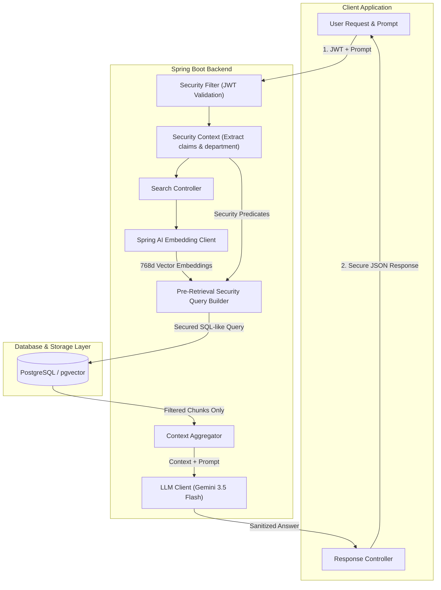

# DocuSense: Enterprise RAG with Multi-Tenant Pre-Retrieval Security

[](https://www.oracle.com/java/)
[](https://spring.io/projects/spring-boot)
[](https://spring.io/projects/spring-ai)
[](https://www.postgresql.org/)
[](LICENSE)

DocuSense is a production-grade, highly secure Retrieval-Augmented Generation (RAG) backend engine designed for enterprise environments. It is built using **Spring Boot 4 (Java 21)**, **Spring Security (JWT)**, **Spring AI (Google Gemini)**, and **PostgreSQL (pgvector)**.

---

## 💡 The Enterprise Challenge: Preventing Data Leakage in AI

Most basic RAG architectures suffer from a critical security vulnerability: **Post-Retrieval Filtering**. In post-retrieval setups:
1. The vector database performs a semantic search across *all* documents.
2. The application filters out unauthorized results *after* they are retrieved.

This pattern is highly problematic for enterprise deployment. It exposes organizations to **data leakage** (unauthorized data loaded into application memory), **compliance violations** (GDPR/HIPAA audits), and **token waste** (paying to embed and process chunks the user cannot see).

### The Solution: Pre-Retrieval Scope Filtering
DocuSense solves this by implementing **Pre-Retrieval Scope Filtering**. The system extracts security claims (department ownership, role hierarchies) directly from the user's JWT and translates them programmatically into a secure SQL-like `Filter.Expression` predicate before querying the vector database. 

The vector database only performs similarity searches on chunks the user is actively authorized to view. Unauthorized documents never leave the database layer.

---

## 🏗️ Architecture & Data Flow



---

## 🚀 Key Technical Features

* **Pre-Retrieval Security (Scope Filtering):** Dynamically parses and builds abstract metadata syntax trees (AST) using Spring AI's `FilterExpressionTextParser` to filter database records *before* executing vector distance matching.
* **Role-Based Access Control (RBAC):** Custom JWT authentication containing claims for department and role hierarchy (e.g., `ROLE_USER`, `ROLE_MANAGER`, `ROLE_ADMIN`).
* **Asynchronous Document Ingestion:** Uses Apache Tika to parse multiple file formats (PDF, DOCX, TXT), split them into chunks via `TokenTextSplitter`, enrich them with metadata (department tags, timestamps, source identifiers), and vectorize them asynchronously.
* **Embedding Dimension Optimization (Matryoshka Learning):** Configured to scale Gemini's `text-embedding-004` model output down to **768 dimensions** (from 3072) to stay within PostgreSQL's HNSW index limitations, while lowering indexing memory footprints and retaining over 95% retrieval accuracy.
* **Secure Semantic Caching (Redis):** Caches secure queries using SHA-256 hashes generated from the combination of user security scopes and query text (`SHA-256(department + role + query)`).

---

## 🛠️ Tech Stack & Libraries

* **Core Framework:** Java 21, Spring Boot 4.1.0, Spring Security (JWT)
* **AI & LLM Integration:** Spring AI 2.0.0 (BOM), Google GenAI SDK (`gemini-3.5-flash`, `text-embedding-004`)
* **Vector Store & Database:** PostgreSQL 18.4, pgvector extension, Spring Data JPA
* **Document Parsing:** Apache Tika Document Parser, TokenTextSplitter
* **Caching:** Spring Data Redis, Redis Server
* **Utilities:** Lombok, JJWT (JsonWebToken), springboot3-dotenv

---

## 📂 Project Structure

```
DocuSenseApi/
├── src/
│   ├── main/
│   │   ├── java/com/docusense/backend/
│   │   │   ├── config/          # Spring Security, Redis & Spring AI Configuration
│   │   │   ├── controller/      # Auth, Document Ingestion & Search API Endpoints
│   │   │   ├── model/           # JPA Entities & DTOs (User, Document, Chunks)
│   │   │   ├── repository/      # UserRepository, VectorStore interfaces
│   │   │   ├── security/        # JWT Filtering & Custom Authentication
│   │   │   └── service/         # Ingestion, Search, Caching & Vector Building Services
│   │   └── resources/
│   │       ├── application.properties
└── pom.xml
```

---

## 🔌 API Specification

### Authentication Endpoints

#### `POST /api/auth/register`
Registers a new user and assigns them to a department and RBAC role.
```json
{
  "username": "developer_jane",
  "password": "SecurePassword123!",
  "department": "Engineering",
  "role": "ROLE_USER"
}
```

#### `POST /api/auth/login`
Authenticates credentials and returns a secure JWT containing authorization claims.
```json
{
  "username": "developer_jane",
  "password": "SecurePassword123!"
}
```
*Response Header:* `Authorization: Bearer <JWT_TOKEN>`

### Document & Search Endpoints (Secure)

#### `POST /api/documents/upload`
*Restricted to: `ROLE_ADMIN`, `ROLE_MANAGER`*  
Uploads a document file (PDF, DOCX, TXT) and tags it for a specific department.
* **Form-Data:** 
  * `file`: (Binary File)
  * `department`: `"Engineering"`

#### `POST /api/search`
*Restricted to: Authenticated users*  
Performs a secure, department-restricted semantic query and returns the answer generated by Gemini 3.5 Flash.
```json
{
  "query": "What is our production deployment strategy?"
}
```

---

## 🚀 Setup & Local Installation

### Prerequisites
* **Java 21** (JDK 21)
* **PostgreSQL** (with the `pgvector` extension enabled)
* **Redis** (optional, for caching)
* **Google Gemini API Key**

### 1. Enable pgvector in PostgreSQL
Run the following SQL command in your database client:
```sql
CREATE EXTENSION IF NOT EXISTS vector;
```

### 2. Environment Configuration
Create a `.env` file in the root of the project:
```env
DB_HOST=localhost
DB_PORT=5432
DB_NAME=docusense
DB_USERNAME=postgres
DB_PASSWORD=your_secure_db_password
GEMINI_API_KEY=your_gemini_api_key
JWT_SECRET=your_super_secret_jwt_signing_key_at_least_64_characters
```

### 3. Build & Run
```bash
mvn clean install
mvn spring-boot:run
```

---

## 🧪 Verification & Testing
You can verify the backend endpoints using `curl` or Postman:

1. **Register a User:**
   ```bash
   curl -X POST http://localhost:8080/api/auth/register \
     -H "Content-Type: application/json" \
     -d '{"username":"john_doe","password":"password123","department":"Engineering","role":"ROLE_USER"}'
   ```

2. **Login & Extract JWT:**
   ```bash
   curl -X POST http://localhost:8080/api/auth/login \
     -H "Content-Type: application/json" \
     -d '{"username":"john_doe","password":"password123"}'
   ```

3. **Secure RAG Query:**
   ```bash
   curl -X POST http://localhost:8080/api/search \
     -H "Authorization: Bearer <your_jwt_token>" \
     -H "Content-Type: application/json" \
     -d '{"query":"What is the architecture overview?"}'
   ```
